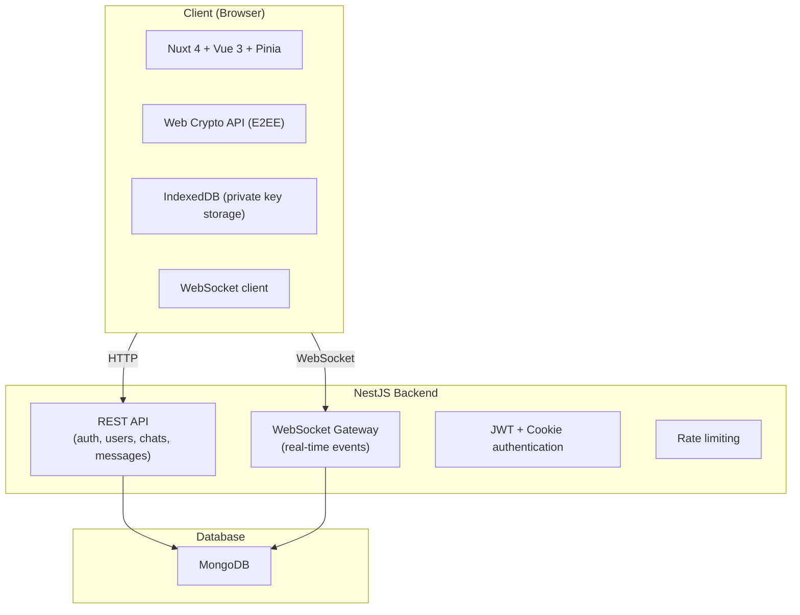

# WhatsApp Clone


A full-stack WhatsApp Web clone built as a showcase project. Features real-time messaging, end-to-end encryption, group chats, and a comprehensive test suite covering unit, integration, and E2E tests.

---

## Table of Contents

- [About](#about)
- [Features](#features)
- [Tech Stack](#tech-stack)
- [Architecture](#architecture)
- [End-to-End Encryption](#end-to-end-encryption)
- [Getting Started](#getting-started)
- [Testing](#testing)
- [CI Pipeline](#ci-pipeline)
- [Project Structure](#project-structure)

---

## About

This project replicates the core experience of WhatsApp Web is a real-time encrypted messaging between users, group chats, message status indicators, and a responsive UI that mirrors the original application. It was built as a technical showcase demonstrating full-stack development, WebSocket communication, cryptography, and professional testing practices.

---

## Features

### Messaging

- Real-time 1:1 and group messaging via WebSockets
- Message status indicators: Sent, Received, Read
- Reply to messages with quoted preview
- Forward messages to other chats
- Delete messages
- Message info (delivery and read receipts)

### Security & Encryption

- End-to-end encryption using the Web Crypto API
- RSA-OAEP key pairs generated per user on registration
- Per-conversation AES-256 keys encrypted with each member's public key
- Private keys encrypted with a user-defined passphrase using AES-GCM
- Recovery codes for passphrase recovery
- Keys stored locally in IndexedDB are never sent to the server in plaintext
- JWT authentication with HTTP-only cookies
- Session token validation on every authenticated request

### Users

- Registration with passphrase setup and recovery codes
- Profile management: name, about, avatar
- Block and unblock users
- Online/offline status with last seen timestamps

### Chats

- Create 1:1 chats
- Create group chats with multiple members
- Group admin management
- Add and remove group members
- Exit group
- Group name updates

### UI

- Dark and light mode
- Responsive layout
- Emoji picker
- Message search within chats
- Typing indicators
- Unread message counts

---

## Tech Stack

### Backend

| Technology                         | Purpose                 |
| ---------------------------------- | ----------------------- |
| NestJS                             | REST API framework      |
| MongoDB + Mongoose                 | Database                |
| WebSockets (`@nestjs/platform-ws`) | Real-time communication |
| JWT + Passport                     | Authentication          |
| bcrypt                             | Password hashing        |
| class-validator                    | Request validation      |
| Helmet                             | HTTP security headers   |
| NestJS Throttler                   | Rate limiting           |

### Frontend

| Technology     | Purpose                  |
| -------------- | ------------------------ |
| Nuxt 4         | Full-stack Vue framework |
| Vue 3          | UI framework             |
| Pinia          | State management         |
| Tailwind CSS   | Styling                  |
| Web Crypto API | End-to-end encryption    |
| IndexedDB      | Local key storage        |
| WebSockets     | Real-time communication  |

### Infrastructure

| Technology              | Purpose          |
| ----------------------- | ---------------- |
| Docker + Docker Compose | Containerisation |
| MongoDB                 | Database         |
| GitHub Actions          | CI pipeline      |

### Testing

| Technology                        | Purpose             |
| --------------------------------- | ------------------- |
| Jest                              | Backend unit tests  |
| Supertest + MongoDB Memory Server | Backend E2E tests   |
| Vitest                            | Frontend unit tests |
| Playwright                        | Frontend E2E tests  |

---

## Architecture



---

## End-to-End Encryption

Messages are encrypted client-side before being sent to the server. The server never has access to plaintext message content.

### Key Generation (on registration)

1. An RSA-OAEP key pair is generated in the browser using the Web Crypto API
2. The private key is encrypted with AES-GCM using a user-defined passphrase
3. The encrypted private key is stored in the database
4. Recovery codes are generated as alternative passphrase recovery options
5. On login, the private key is decrypted locally and stored in IndexedDB

### Message Encryption (per conversation)

1. When a chat is created, a random AES-256 key is generated
2. The AES key is encrypted with each member's RSA public key
3. Each member receives their own encrypted copy of the AES key
4. Messages are encrypted with the AES key before being sent
5. Recipients decrypt the AES key with their private key, then decrypt the message

### What the server stores

- Encrypted message ciphertext
- Encrypted AES keys (one per chat member)
- Encrypted private keys (passphrase-protected)
- Public keys (by design, these are public)

---

## Getting Started

### Prerequisites

- Docker and Docker Compose

### Setup

```bash
# Clone the repository
git clone https://github.com/vortizz/whatsapp.git
cd whatsapp

# Copy environment file
cp .env.example .env

# Start all services
docker compose up --build
```

### Access

| Service     | URL                            |
| ----------- | ------------------------------ |
| Frontend    | http://localhost:3001          |
| Backend API | http://localhost:3000          |
| WebSocket   | ws://localhost:3000/entrypoint |

### Stop

```bash
docker compose down

# Remove database volume too
docker compose down -v
```

---

## Testing

The project has 161 tests across three suites.

### Test Summary

| Suite              | Tests   | Tool       | What's covered                                                          |
| ------------------ | ------- | ---------- | ----------------------------------------------------------------------- |
| Backend unit       | 52      | Jest       | Services, guards, strategies, WebSocket manager                         |
| Frontend unit/nuxt | 69      | Vitest     | Stores, composables, utils, E2EE crypto                                 |
| Frontend E2E       | 40      | Playwright | Auth, chat, messaging, block/unblock, profile, reply, forward, sign out |
| **Total**          | **161** |            |                                                                         |

### Running Tests

**Backend unit tests:**

```bash
cd backend
npm install
npm run test

# With coverage
npm run test:cov
```

**Frontend unit tests:**

```bash
cd fe
npm install
npm run test:run

# Watch mode
npm run test

# With coverage
npm run test:cov
```

**Frontend E2E tests** (requires Docker services running):

```bash
docker compose up -d
cd fe
npm run test:e2e
```

### Notable Tests

**Crypto roundtrip** proves the full E2EE flow works end-to-end:

```
sender generates key pair
→ shared AES key encrypted for both users
→ sender encrypts message
→ receiver decrypts with their copy of the AES key
→ plaintext matches original
```

**Multi-browser messaging**: two Playwright browser contexts exchange real-time encrypted messages, verifying the full stack works together.

**Three-context group messaging**: three simultaneous browser sessions verify group message delivery to all members.

---

## CI Pipeline

Every push to `main` or `develop` automatically runs all three test suites via GitHub Actions.

```
Push to develop/main
        │
        ├── Backend Unit Tests (25s)
        │
        ├── Frontend Unit Tests (30s)
        │
        └── [if both pass] Frontend E2E Tests (9m 30s)
                │
                ├── Docker Compose starts MongoDB + Backend + Frontend
                ├── Playwright runs 40 E2E tests in Chromium
                └── Playwright report uploaded on failure
```

---

## Project Structure

```
whatsapp/
├── backend/                    # NestJS API
│   ├── src/
│   │   ├── auth/               # JWT + Local strategies, guards
│   │   ├── chat/               # Chat service, schemas
│   │   ├── message/            # Message service, schemas
│   │   ├── user/               # User service, schemas
│   │   └── websocket/          # WebSocket gateway, client manager
│   └── test/                   # E2E tests (supertest)
│
├── fe/                         # Nuxt 4 frontend
│   ├── components/             # Vue components
│   ├── composables/            # useCrypto, useIndexedDB, useWs
│   ├── store/                  # Pinia stores
│   ├── pages/                  # Auth and home pages
│   └── test/
│       ├── unit/               # Pure function tests
│       ├── nuxt/               # Store and composable tests
│       └── e2e/                # Playwright E2E tests
│
├── .github/
│   └── workflows/
│       └── test.yml            # CI pipeline
│
└── docker-compose.yml          # Local development setup
```
